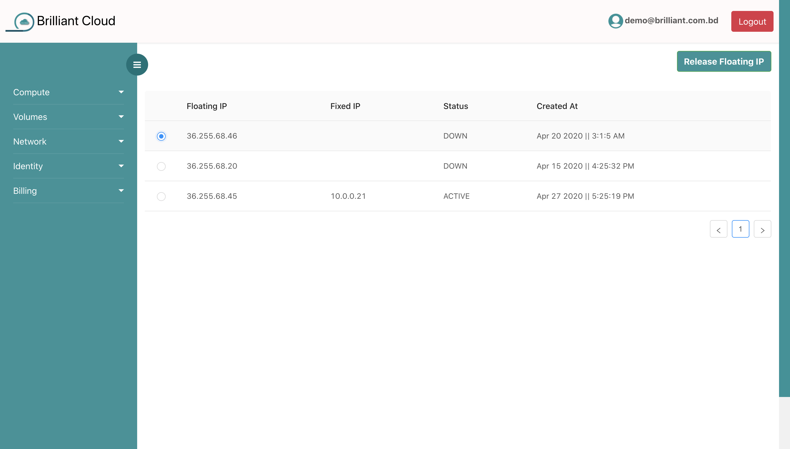

# Floating IP

## what is floating ip?

VM with an assigned floating IP address can be accessed from the public network by the floating IP.

## releasing floating ip

Floating Ip is costly. If you have some idle floating ip, you have to pay extra cost. Thats why, if you dont want to use floating ip, you have to release it. If you release a floating ip, you can not use it for public access.

Before releasing floating ip, **you have to disaccociate floating ip from your VM**.Then, just select floating ip and press **Release FLoating IP** button.

