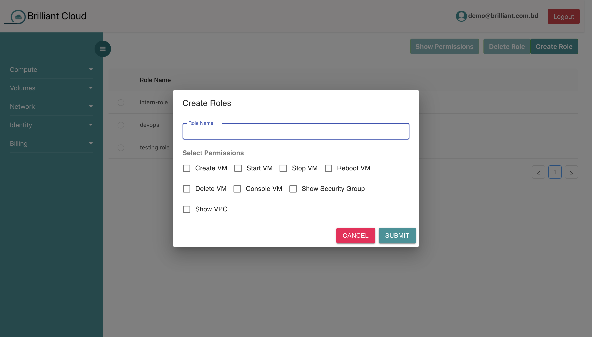
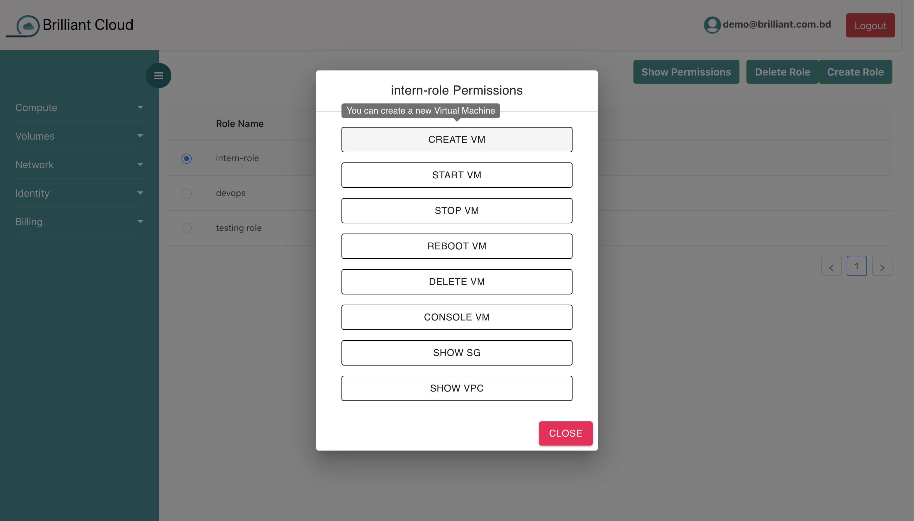
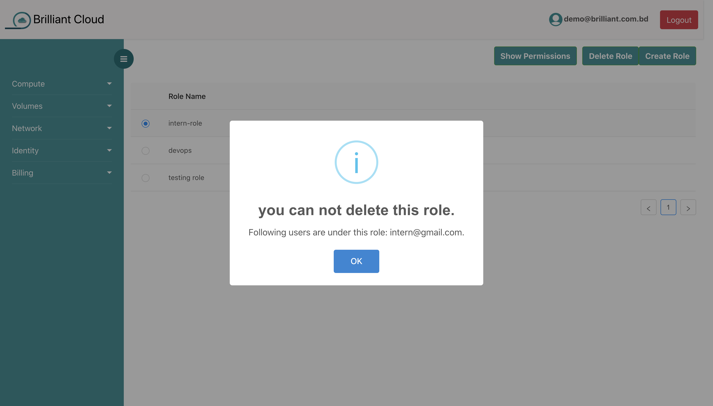
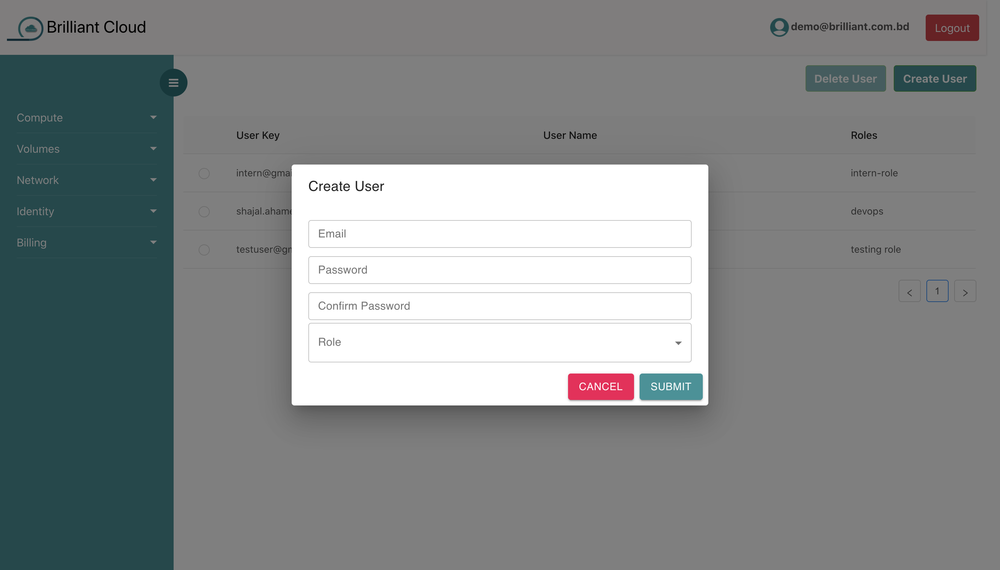
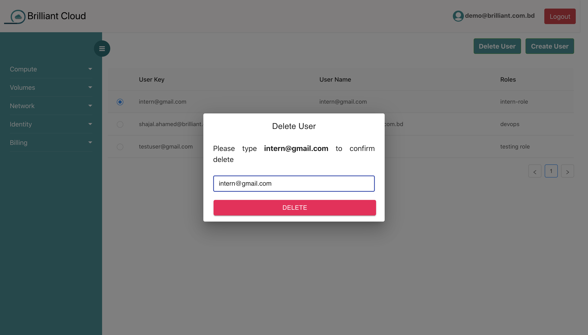

# Identity

## Usage of Role

Role defines your activity in this platform. You can assign different roles to different users.

## Creating Role

You can define users role here. You can find several role options here. Choose your preferred role for the user.

## Show Role Permissions

Just select the role and click **Show Permission** button, you can see your defined roles.

## Delete Role

You have to delete user first then you can delete your role.

## Creating User

User creation is very simple. Just fill up the form and select specific role for the user.

## Deleting User

Select the user and click **Delete User** button. Type the user name and click delete button. User deletion will be completed.

