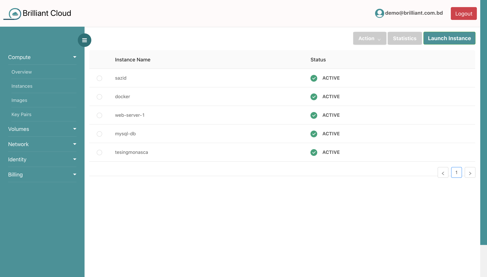
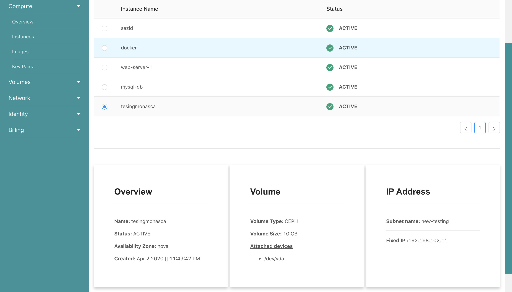
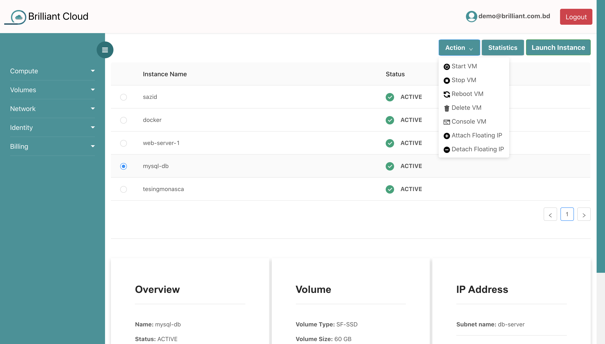

# Instances

## Instance List

You can see your all instances. You can also find your instances status like active, stop etc.

## Instance Details

If you select an instance, instance details will be shown in the bottom of the page. Here, you can find instance overview, volume and IP address details information.

## Instance Actions

Instance action is very straight forward. If you select an instance, you can start, stop, reboot and delete your instances. You can also console in your instances. Besides, You can attach and detach public ip in your instances.

