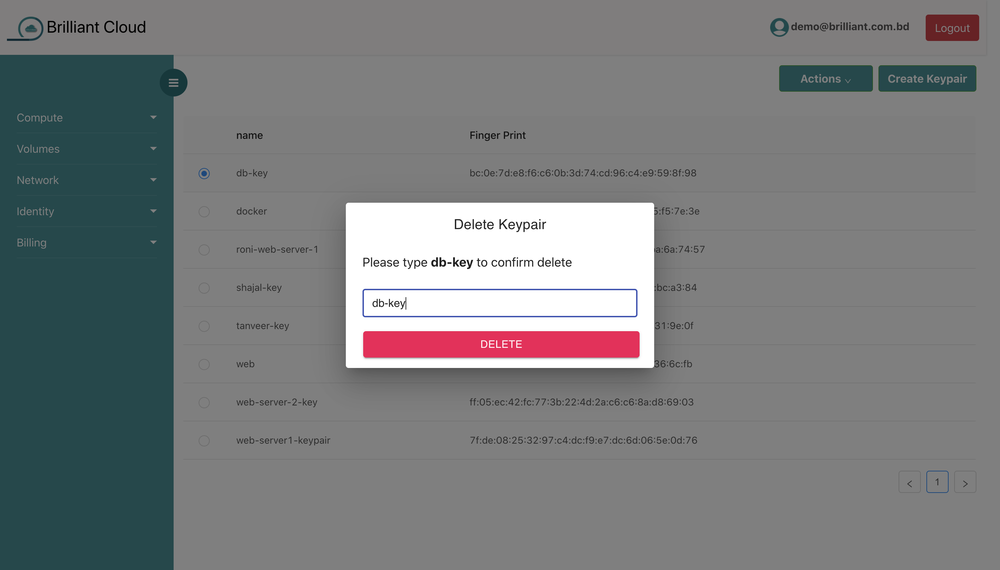

# Key Pair

## what is key pair?

VM uses public key cryptography to encrypt and decrypt login information. Public key cryptography uses a public key to encrypt a piece of data, and then the recipient uses the private key to decrypt the data. The public and private keys are known as a key pair.

## creating key pair

You have to just give a key pair name and click the submit button, your **key will be downloaded in pem file** automatically. It will be **downloaded only once** when you create it.**Dont lose your downloaded key pair**. If you lose it, you will lose access to your vm for good and can not retreive it.

## show key pair

## deleting key pair

Deleting key pair is straight forward. You have to just type the key pair name for deletion.

