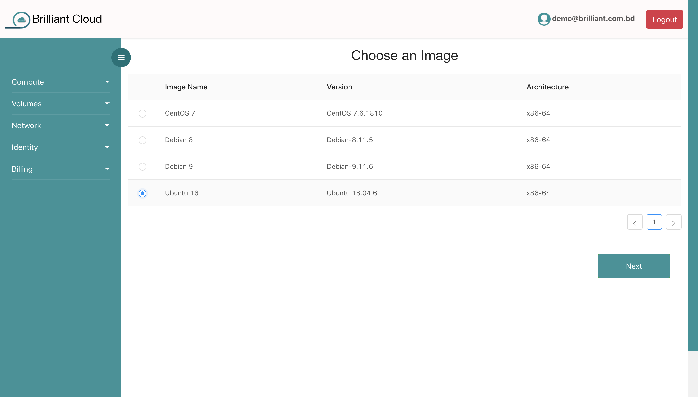
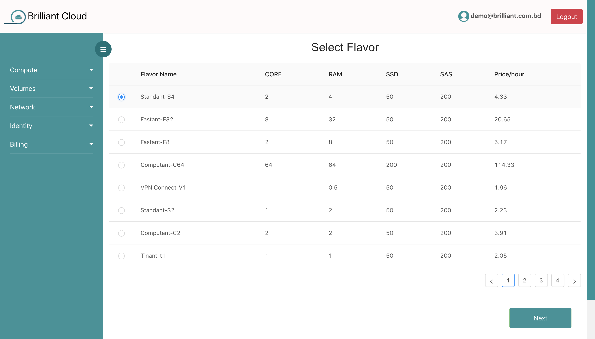
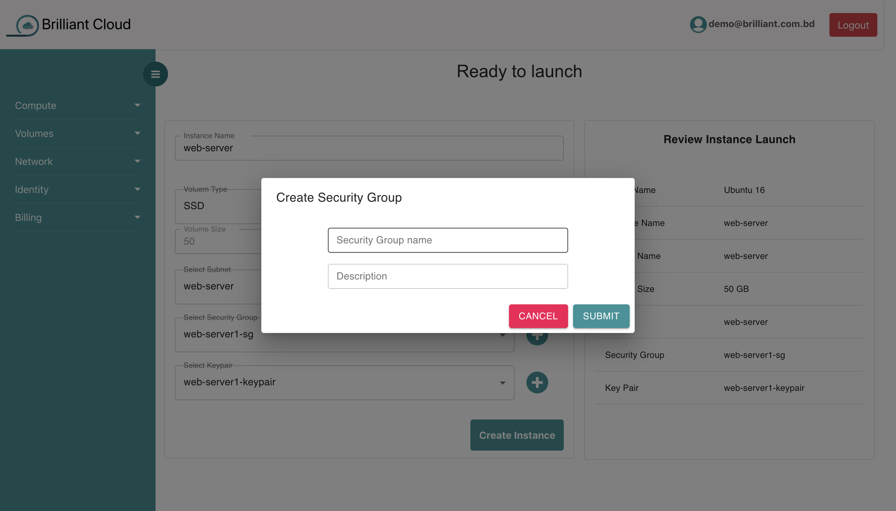
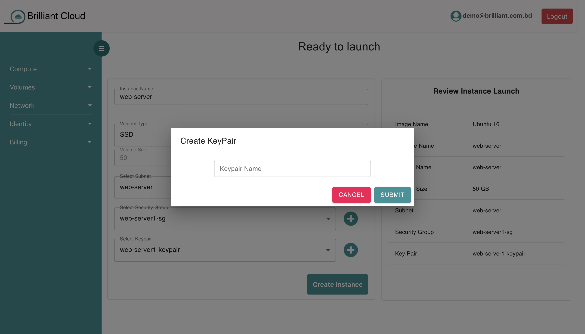
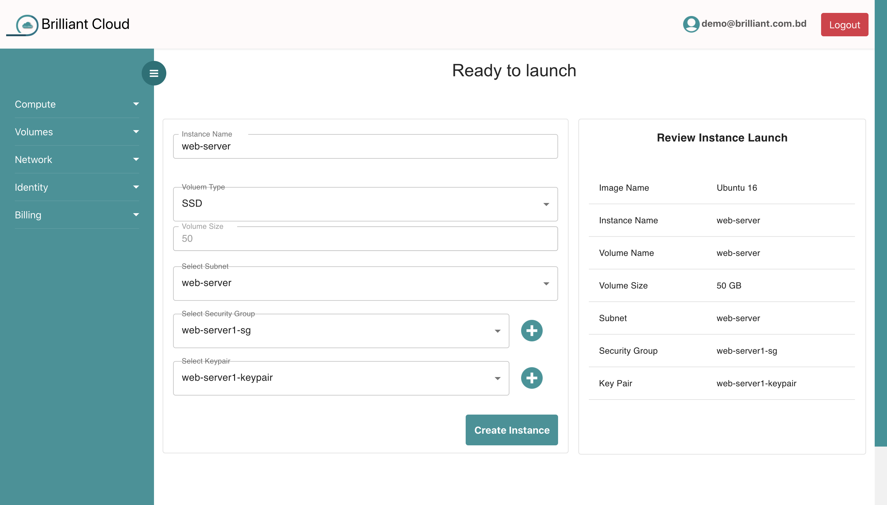

# Launch Instance

By following the steps you can launch your Virtual Machine in our platform.

## Select Image

Just select your preferred image.

## Select Flavor

Lots of flavor are here. Select flavor according to your choice.

## Ready to Launch

You can select security group or you can create security group here.

You can select key-pair or you can create key-pair here.

Fill up rest of the information. Before clicking **Create Instance** you can review your all information. Then, just click the **Create Instance** button and you are ready to go. After this, you will be redirected to instances page. Refresh this page for getting your latest instance information.

