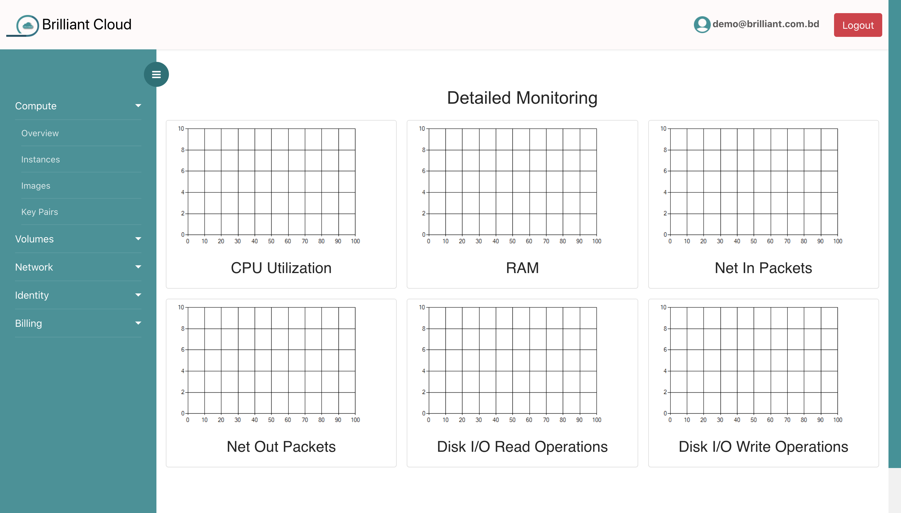
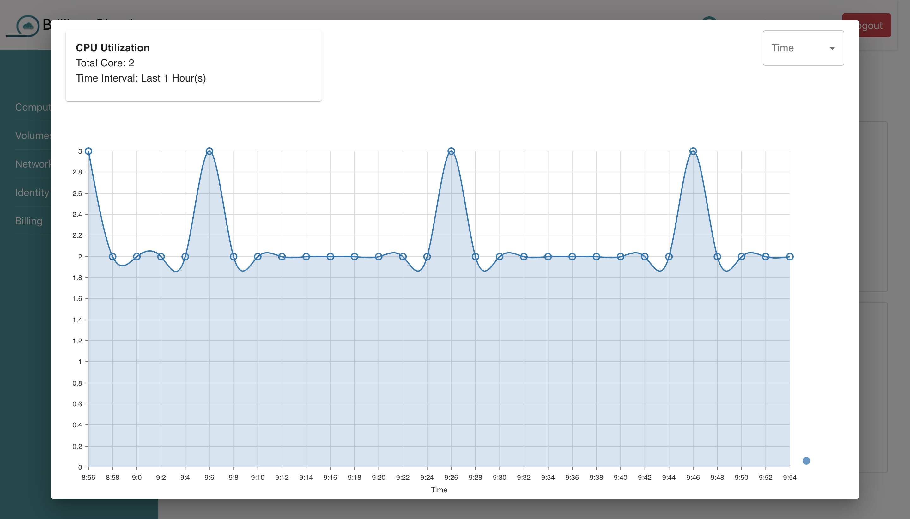
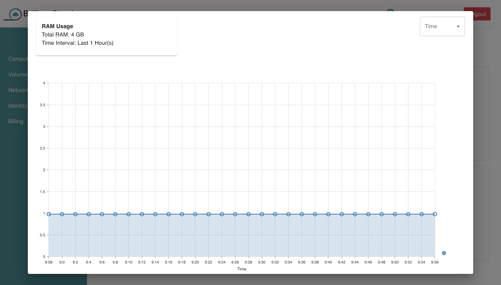
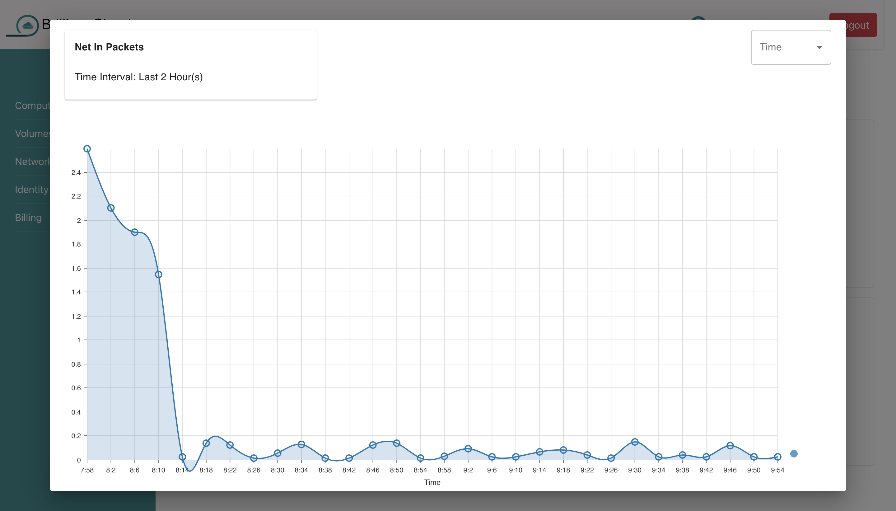
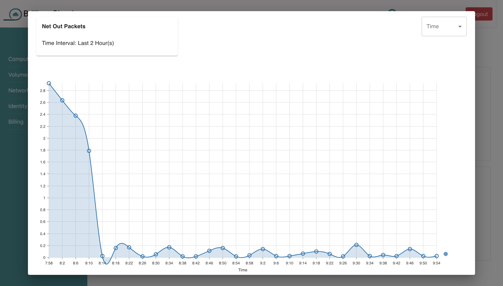

# Monitoring and Statistics

You can watch your cloud metrics for the selected resources.

## Details Monitoring

Click on a graph to see an expanded view.

## CPU Utilization

You can watch your cpu utilization for selected virtual machine. You can find total core of your vm. Different time range also can be selected.

## Memory (RAM) Used

You can watch your ram usage for selected virtual machine. You can find total ram of your vm.Different time range also can be selected.

## Net In Packets

You can watch your net in packets for selected virtual machine. Different time range also can be selected.

## Net Out Packets

You can watch your net out packets for selected virtual machine. Different time range also can be selected.

