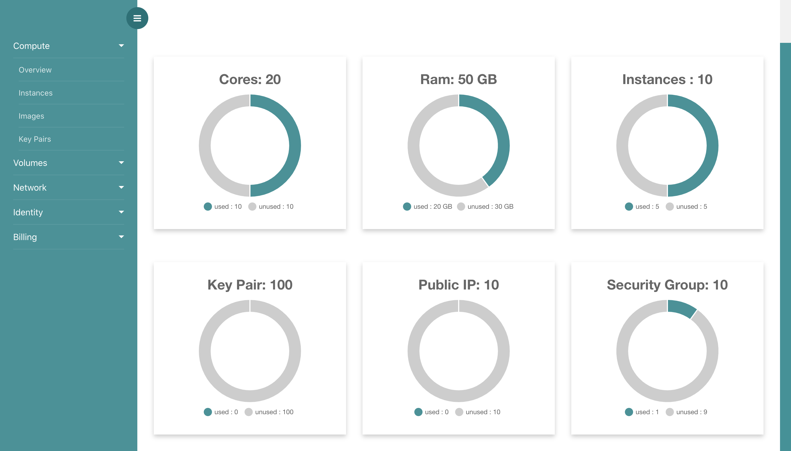

# Overview

## Brilliant Platform Overview

From overview, you can observe your resources. Here, you can see core, ram, number of vm, number of key-pair, security group and number of public ip etc.   

