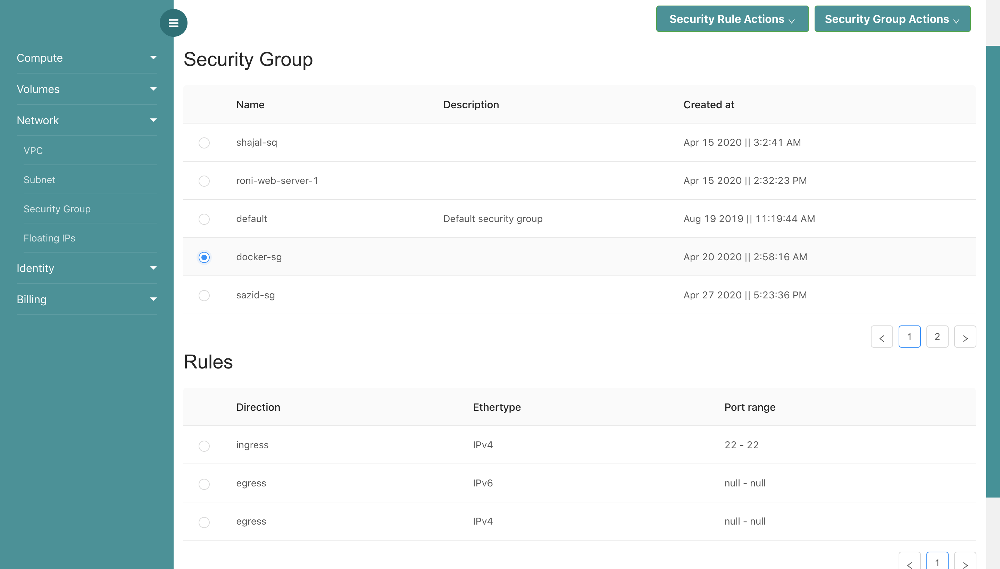
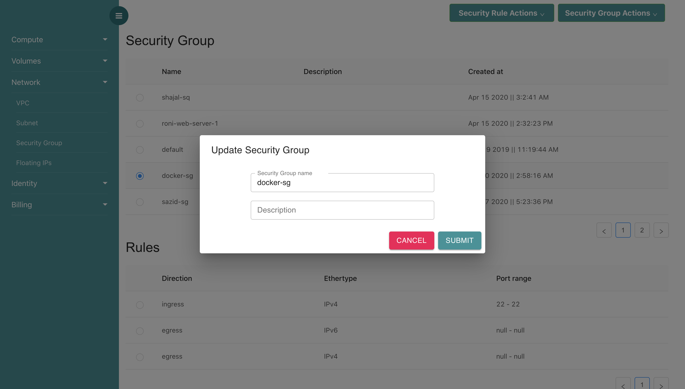
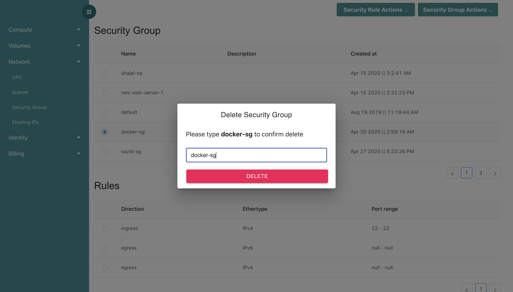
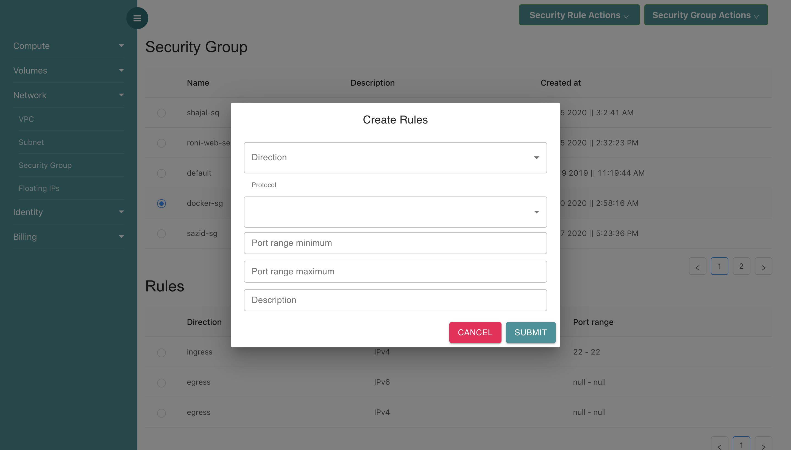
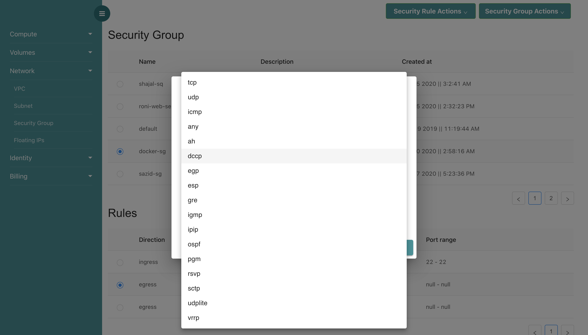
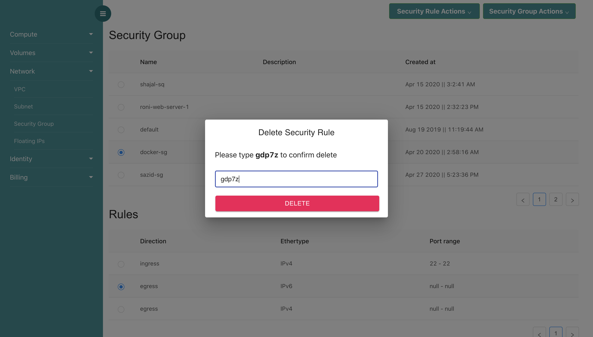

# Security Group

## What is Security Group?

Security groups (SGs) are associated with VM and provide security at the protocol and port access level. Each security group — working much the same way as a firewall — contains a set of rules that filter traffic coming into and out of a VM.

## creating Security Group

By clicking **Security Group Actions** button, you can find **Create Security Group** option. Here, You have to give a security group name and description.

## editing Seciruty Group

In **Security Group Actions**, You can find **Edit Security Group** option. In this option, you can edit security group name and description. 

## deleting Security Group

Deleting Security Group is straight forward. You have to just type **Security Group Name** for deletion.

## creating Security Rules

Every Security Group should have a security rule. Security Rules are used for controlling ingress and egress traffic as well as controlling some protocols like icmp, tcp etc for accessing virtual machines.

In **Security Rule Actions**, you can find **Create Security Rule** option. You have to specify traffic ingress or egress, select protoclos, port range minimum and maximum number. Also, never forget to give some description.If you give only minimum port number, then maximum port number will be the same as minimum port number.

If you want to activate **icmp** protocol, **you dont need to give port number**. If you want to activate **ssh** protocol, **you have to select tcp** protocol and give port number **22** in minimum port range and maximum port range. 

## deleting Security Rules

Deleting Security Rule is straight forward.

