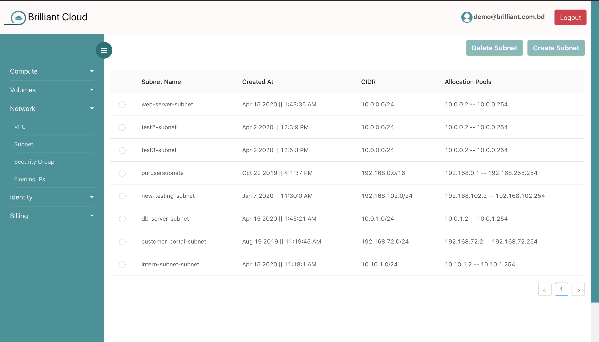
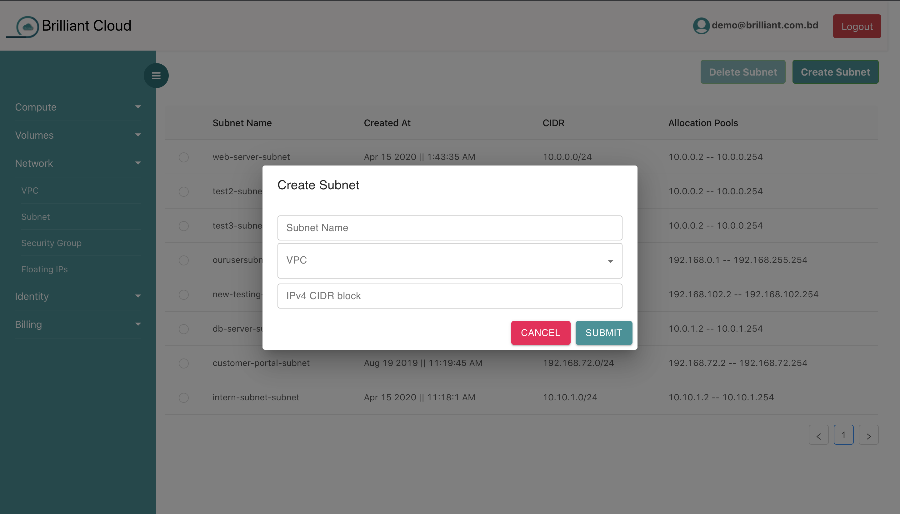
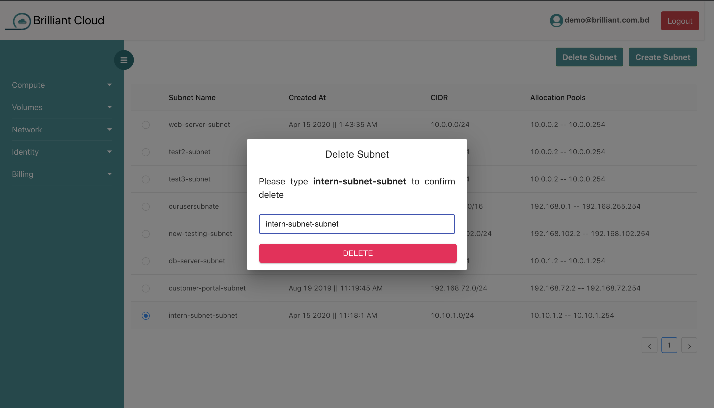
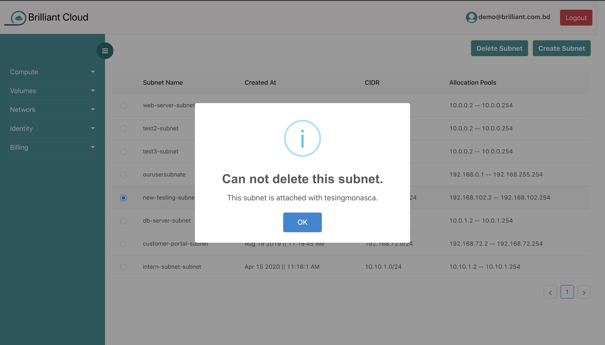

# Subnet

## what is subnet?

A subnetwork or subnet is a logical subdivision of an IP network. The practice of dividing a network into two or more networks is called subnetting. Computers that belong to a subnet are addressed with an identical most-significant bit-group in their IP addresses.

## Brilliant Cloud platform Subnet

Each Subnet should be attached with VPC. Each VPC can contain at most four subnet.

## creating a Subnet

By clicking the **create subnet** button and filling up the form you can create a subnet.You must give your subnet a name, select a vpc that already exist and give proper CIDR block in this format **10.0.0.0/24** .
You can create **atmost 4** subnet under a VPC.

## Deleting a Subnet

to delete a subnet you have to click on the Delete subnet button. 

Remember you can delete your subnet only when **it has no vm attached to it.**
