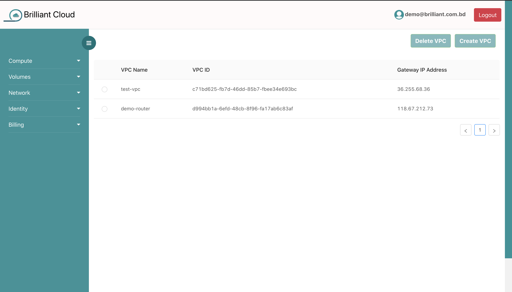
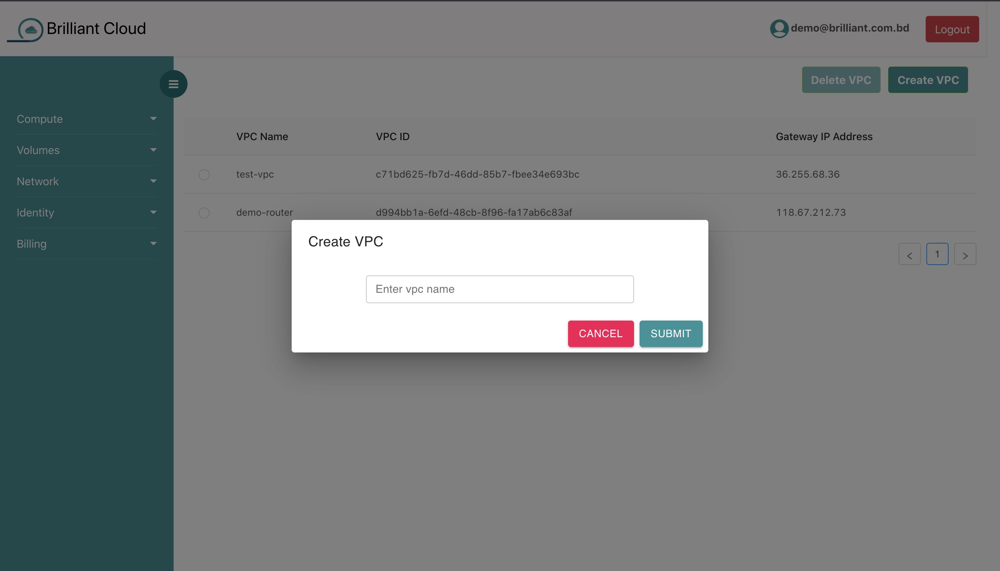
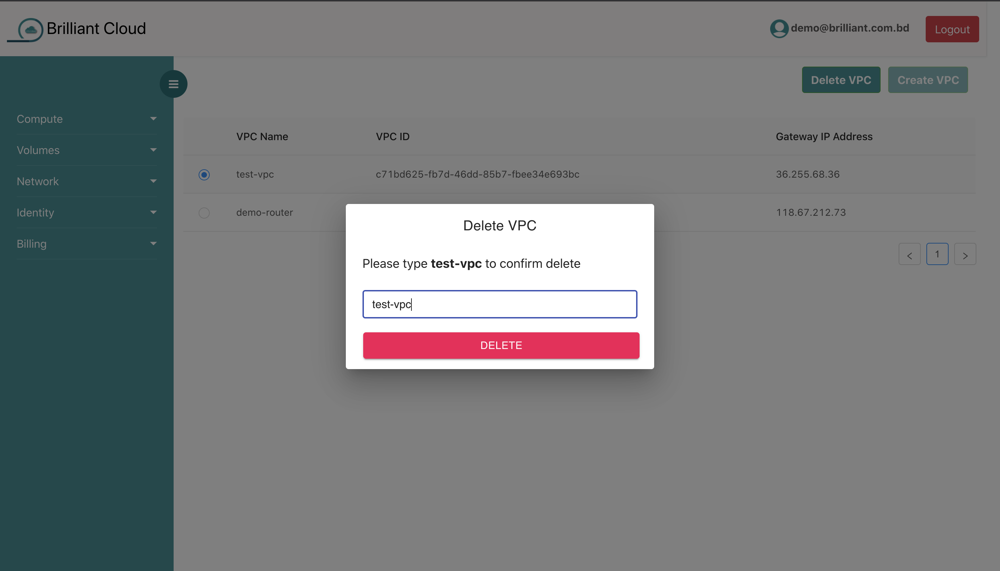
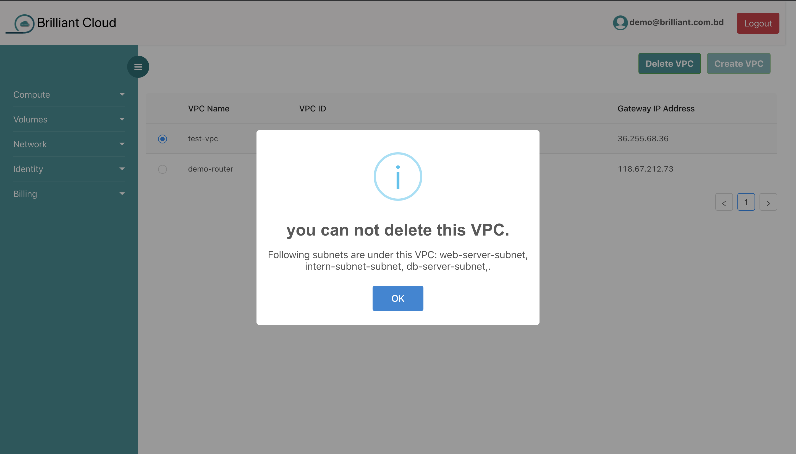

# VPC 

## what is vpc?

Virtual Private Cloud (VPC) enables you to launch  resources into a virtual network that you've defined. This virtual network closely resembles a traditional network that you'd operate in your own data center.

## Brilliant Cloud platform VPC

By using Brilliant cloud you can cerate two vpc using your brilliant account. Each VPC can contain at most four subnets where you can launch your virtual machine (VM).

## Creating a VPC

By clicking the **create vpc** button and filling up the form you can create a vpc.
You can create **atmost 2** vpc with single account.

click the submit button. depending on your internet connecton your vpc will be created within a short time.

## Deleting a vpc

to delete a vpc you have to click on the Delete vpc button. 

Remember you can delete your vpc only when **it has no subnet attached to it.**
